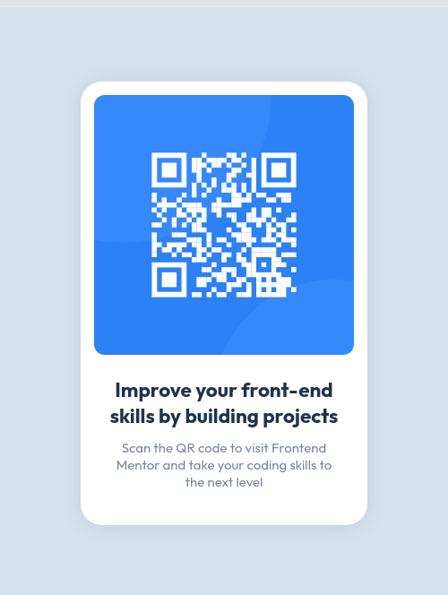
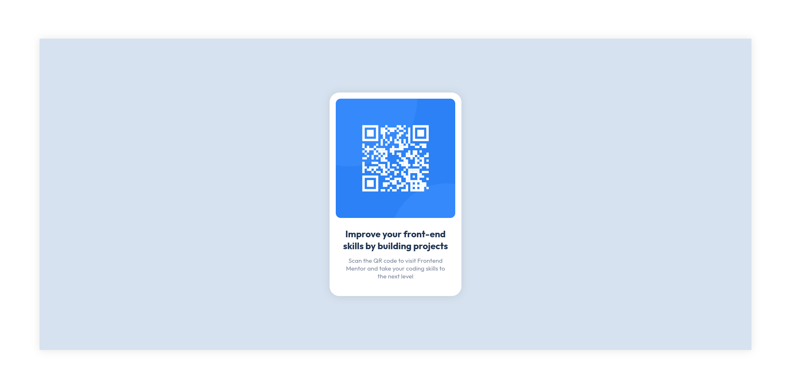

# Frontend Mentor - QR code component solution

This is a solution to the [QR code component challenge on Frontend Mentor](https://www.frontendmentor.io/challenges/qr-code-component-iux_sIO_H). This is my first challenge solved in Frontend Mentor 

## Table of contents

- [Frontend Mentor - QR code component solution](#frontend-mentor---qr-code-component-solution)
  - [Table of contents](#table-of-contents)
  - [Overview](#overview)
    - [Screenshot](#screenshot)
    - [Links](#links)
  - [My process](#my-process)
    - [Built with](#built-with)
    - [Continued development](#continued-development)
  - [Author](#author)
## Overview

### Screenshot

### Links

- Solution URL: [Add solution URL here](https://your-solution-url.com)
- Live Site URL: [Add live site URL here](https://your-live-site-url.com)

## My process

### Built with

- Semantic HTML5 markup
- CSS custom **properties**
- Flexbox
- CSS Grid
- Mobile-first workflow

### Continued development
Develop projects to train JavaScript

## Author

- Website - [jstevenfm](https://jstevenfm.github.io/)
- Frontend Mentor - [@jstevenfm](https://www.frontendmentor.io/profile/jstevenfm)
- Twitter - [@jstevenfm](https://www.twitter.com/jstevenfm)

